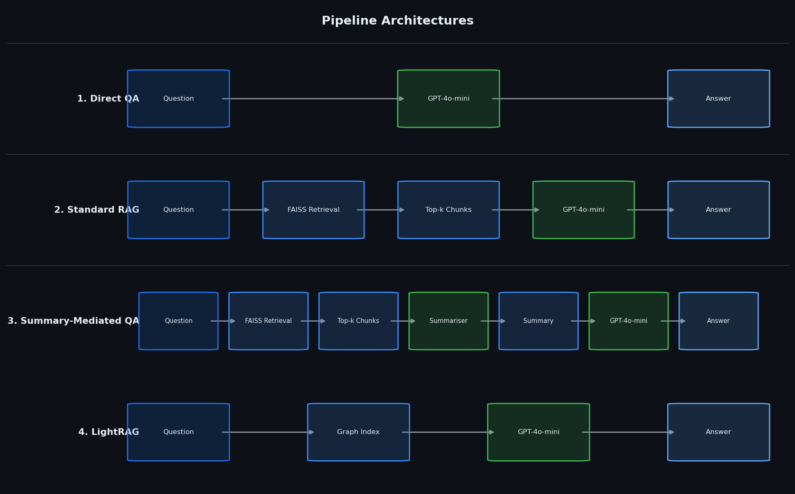
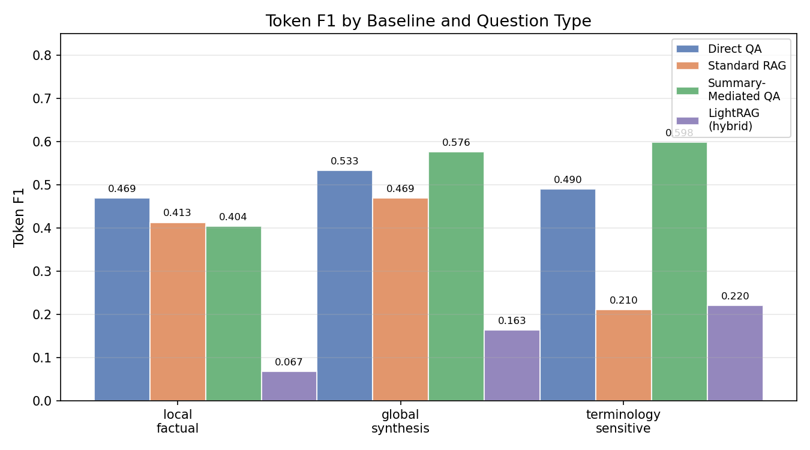
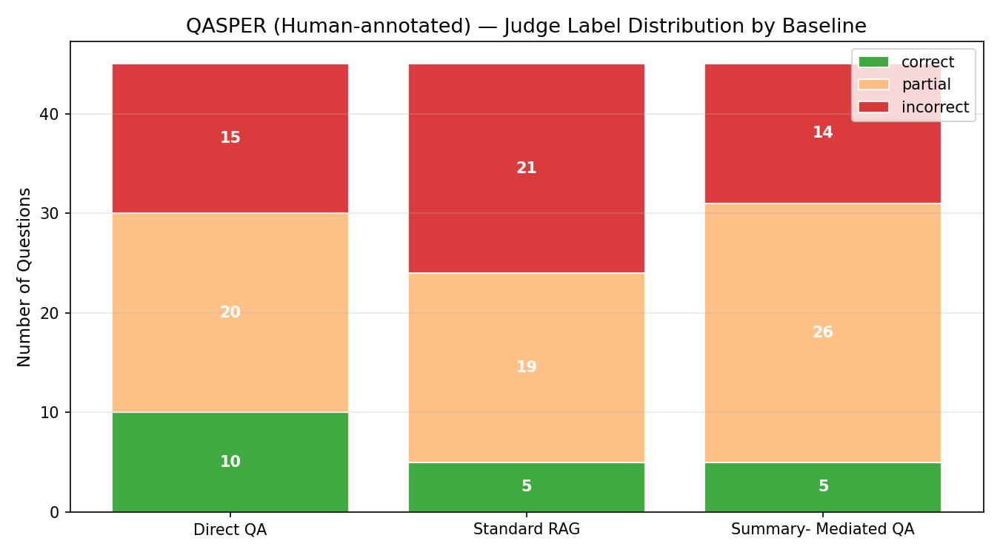
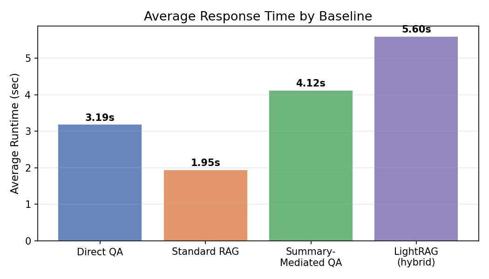

# RAG Benchmark on PubMedQA

> Does retrieval always help? A systematic comparison of RAG strategies for biomedical question answering.

A benchmark of four QA pipelines on **PubMedQA** (`pqa_labeled`, n=45 per pipeline), evaluated with both token-level F1 and an LLM-as-judge framework (GPT-4o-mini). The central question: how much does the retrieval strategy matter, and when does retrieval actually hurt?

---

## Motivation

Retrieval-Augmented Generation (RAG) is widely assumed to improve LLM QA performance over pure generation — but this assumption is dataset- and strategy-dependent. Standard chunk retrieval can introduce noise (irrelevant passages, terminology mismatch) that degrades answer quality. This project tests whether a summarisation step between retrieval and generation can act as a noise filter, and at what cost in latency.

---

## Pipeline Architectures



| # | Pipeline | Description |
|---|----------|-------------|
| 1 | **Direct QA** | Question → GPT-4o-mini (no retrieval) |
| 2 | **Standard RAG** | Question → FAISS chunk retrieval → GPT-4o-mini |
| 3 | **Summary-Mediated QA** | Question → FAISS retrieval → question-guided summary → GPT-4o-mini |
| 4 | **LightRAG** | Graph-based retrieval using entity/relation graphs (standalone runner) |

The key design difference between Pipeline 2 and 3 is the intermediate summarisation step: rather than feeding raw retrieved chunks directly to the LLM, Pipeline 3 first compresses them into a 3–5 sentence question-focused summary. This reduces context noise before answer generation.

---

## Results

### Token F1 by Pipeline and Question Type



| Pipeline | Local Factual | Global Synthesis | Terminology-Sensitive | **Overall F1** |
|----------|:---:|:---:|:---:|:---:|
| Direct QA | 0.469 | 0.533 | 0.490 | **0.497** |
| Standard RAG | 0.413 | 0.469 | 0.210 | **0.364** |
| Summary-Mediated QA | 0.404 | 0.576 | **0.598** | **0.526** |
| LightRAG (hybrid) | 0.067 | 0.163 | 0.220 | **0.150** |

### LLM Judge Verdict Distribution



| Pipeline | Correct | Partial | Incorrect | **Avg Judge Score** |
|----------|:---:|:---:|:---:|:---:|
| Direct QA | 33 | 10 | 2 | **0.844** |
| Standard RAG | 23 | 10 | 12 | **0.622** |
| Summary-Mediated QA | **34** | 11 | 0 | **0.878** |
| LightRAG (hybrid) | 3 | 19 | 23 | **0.278** |

### Runtime Comparison



| Pipeline | Avg Runtime |
|----------|:-----------:|
| Direct QA | 3.19s |
| Standard RAG | **1.95s** |
| Summary-Mediated QA | 4.12s |
| LightRAG (hybrid) | 5.60s |

---

## Key Findings

**1. Standard RAG underperforms Direct QA.**
Despite using retrieval, Standard RAG (F1=0.364, judge=0.622) performs worse than the no-retrieval baseline (F1=0.497, judge=0.844). This is most pronounced on terminology-sensitive questions (0.210 vs 0.490), where retrieved chunks introduce conflicting medical terminology that confuses the LLM rather than helping it.

**2. The summarisation step recovers — and exceeds — direct generation quality.**
Summary-Mediated QA (F1=0.526, judge=0.878) outperforms both Direct QA and Standard RAG. By compressing retrieved passages into a question-focused 3–5 sentence summary before answer generation, it filters out irrelevant context. It achieves the highest correct count (34/45) with zero incorrect verdicts from the LLM judge.

**3. Retrieval is most beneficial for synthesis questions.**
On global synthesis questions (requiring integration of multiple passages), all retrieval-based methods improve over Direct QA. Summary-Mediated QA gains the most (0.576 vs 0.533 for Direct QA). On local factual questions, Direct QA is marginally better — the model's parametric knowledge is sufficient.

**4. LightRAG underperforms in this setting.**
LightRAG's graph-based retrieval (F1=0.150, judge=0.278) is poorly suited to the PubMedQA format. The graph construction overhead and retrieval granularity are optimised for broader knowledge synthesis tasks, not short biomedical abstract QA. This highlights that RAG architecture choice must match the task structure.

**5. Speed vs quality trade-off.**
Standard RAG is fastest (1.95s/question) but lowest quality. The additional LLM call in Summary-Mediated QA costs ~2.2s extra (4.12s total) for a meaningful accuracy gain. Whether this trade-off is acceptable depends on latency requirements.

---

## Implementation Details

### Chunking Strategy
Documents are split using a token-based sliding window (`tiktoken`, `cl100k_base`). Section boundaries are respected first — if a section fits within `chunk_size` (400 tokens), it is kept whole. Sections exceeding the limit are split with an 80-token overlap to preserve context continuity across chunk boundaries.

### Retrieval
Chunks are embedded with `text-embedding-3-small` and indexed with FAISS (`IndexFlatIP`, inner product). At inference time, the query is embedded with the same model and the top-5 chunks are retrieved.

### Evaluation
Two complementary metrics are used:
- **Token F1** (SQuAD-style): lexical overlap between gold and predicted answer tokens. Sensitive to exact phrasing.
- **LLM-as-judge**: GPT-4o-mini rates each prediction as `correct` (1.0) / `partial` (0.5) / `incorrect` (0.0) with a one-sentence rationale. Captures semantic correctness that token F1 misses.

Questions are categorised into three types — **local factual**, **global synthesis**, **terminology-sensitive** — to reveal per-strategy strengths.

---

## Tech Stack

- **LLM & Embeddings**: `gpt-4o-mini` · `text-embedding-3-small` (OpenAI)
- **Retrieval**: FAISS (`faiss-cpu`) + tiktoken-based chunking
- **Dataset**: `qiaojin/PubMedQA` via HuggingFace Datasets
- **Evaluation**: LLM-as-judge + token-level F1

---

## Project Structure

```
.
├── config.yaml                  # All hyperparameters and paths
├── run_experiment.py            # Main pipeline runner
├── run_judge.py                 # LLM-as-judge evaluation
├── run_lightrag_standalone.py   # LightRAG runner (requires Python 3.10+)
├── baselines/
│   ├── direct_qa.py             # Pipeline 1: no retrieval
│   ├── standard_rag.py          # Pipeline 2: chunk retrieval → LLM
│   ├── summary_mediated_qa.py   # Pipeline 3: retrieval + summarisation → LLM
│   └── lightrag_runner.py       # Pipeline 4: graph-based retrieval
├── retrieval/
│   ├── chunking.py              # Token-based chunking with section boundaries
│   ├── embed_index.py           # FAISS index build / load / save
│   └── retrieve.py              # Top-k retrieval
├── evaluation/
│   ├── llm_judge.py             # LLM-as-judge scoring (GPT-4o-mini)
│   ├── metrics.py               # Token F1, exact match, retrieval hit rate
│   └── failure_analysis.py      # Failure case extraction
├── results/
│   └── analysis/                # Figures and aggregated outputs
└── .env.example                 # API key template
```

---

## Estimated Runtime

Based on actual measurements (n=50 questions, GPT-4o-mini, `text-embedding-3-small`):

| Stage | Time |
|-------|------|
| Data download + FAISS index build | ~3–5 min |
| Direct QA (3.19s/q × 50) | ~2.7 min |
| Standard RAG (1.95s/q × 50) | ~1.6 min |
| Summary-Mediated QA (4.12s/q × 50) | ~3.4 min |
| LightRAG (5.60s/q × 50) | ~4.7 min |
| LLM-as-judge evaluation (180 records) | ~5–6 min |
| **Total (all 4 pipelines + judge)** | **~21–23 min** |

To run only 2–3 pipelines, subtract the skipped pipeline time. Running with `--limit 5` completes in ~2 min for quick validation.

> **API cost estimate**: running all 4 pipelines + judge on n=50 questions costs roughly **$0.10–0.20** with GPT-4o-mini.

---

## Setup

```bash
pip install -r requirements.txt
cp .env.example .env   # add your OpenAI API key
```

## Usage

```bash
# Run all pipelines
python run_experiment.py

# Run specific pipelines only
python run_experiment.py --baselines direct_qa standard_rag

# Quick test with 5 questions
python run_experiment.py --limit 5

# LLM-as-judge evaluation
python run_judge.py

# Visualise results
python visualize_results.py && python visualize_judge.py
```

## Configuration

| Parameter | Default | Description |
|-----------|---------|-------------|
| `dataset.num_docs` | 50 | Documents to index |
| `dataset.num_questions` | 50 | QA pairs to evaluate |
| `llm.model` | `gpt-4o-mini` | Answer generation model |
| `embedding.model` | `text-embedding-3-small` | Embedding model |
| `retrieval.chunk_size` | 400 | Token-level chunk size |
| `retrieval.chunk_overlap` | 80 | Overlap between chunks |
| `retrieval.top_k` | 5 | Retrieved chunks per query |

---

## Dataset

**PubMedQA** (`qiaojin/PubMedQA`, `pqa_labeled` split) — expert-annotated biomedical QA pairs derived from PubMed abstracts. Each instance contains a research question, structured context passages (section-level), and a long-form answer with a yes/no/maybe label.

Questions are manually categorised into three types for fine-grained analysis:
- **Local factual** — answerable from a single passage
- **Global synthesis** — requires integrating information across multiple sections
- **Terminology-sensitive** — correct answer depends on precise medical terminology

---

## References

- Jin et al. (2019). *PubMedQA: A Dataset for Biomedical Research Question Answering.* EMNLP.
- Lewis et al. (2020). *Retrieval-Augmented Generation for Knowledge-Intensive NLP Tasks.* NeurIPS.
- Edge et al. (2024). *From Local to Global: A Graph RAG Approach to Query-Focused Summarization.*
