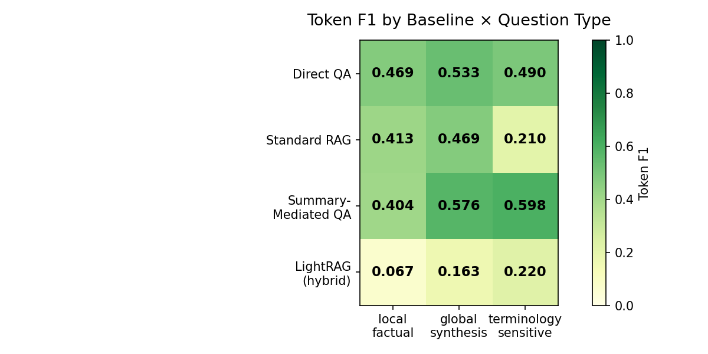
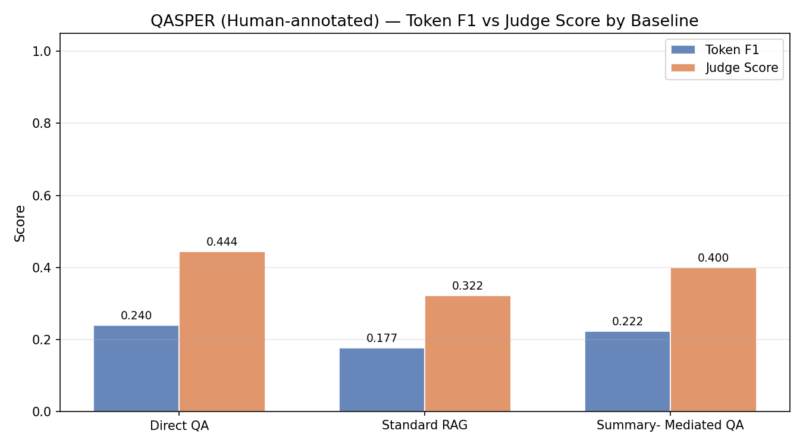
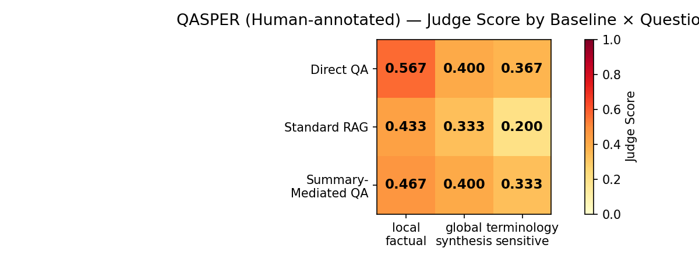
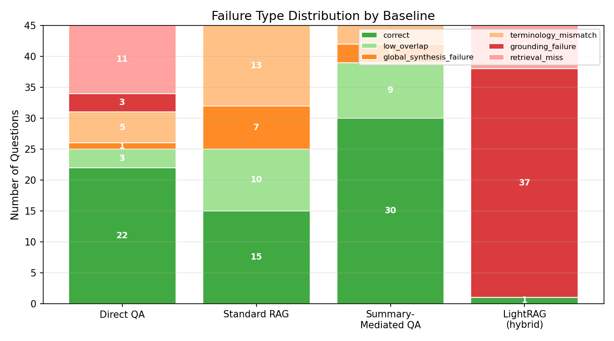

# RAG Benchmark on PubMedQA

> Comparing retrieval-augmented generation strategies for biomedical question answering.

A systematic benchmark of four QA pipelines on the **PubMedQA** dataset (`pqa_labeled`, n=50), evaluated with token-level F1 and an LLM-as-judge framework.

---

## Pipelines Compared

| # | Pipeline | Description |
|---|----------|-------------|
| 1 | **Direct QA** | Question → LLM (no retrieval baseline) |
| 2 | **Standard RAG** | Question → chunk retrieval (FAISS) → LLM |
| 3 | **Summary-mediated QA** | Question → chunk retrieval → question-guided summary → LLM |
| 4 | **LightRAG** | Graph-based retrieval (standalone runner, requires Python 3.10+) |

---

## Results

### Token F1 by Pipeline


*Figure 1 — Token-level F1 scores across the four QA pipelines.*

### F1 Heatmap (per question)



*Figure 2 — Per-question F1 scores for each pipeline (rows = questions, columns = pipelines).*

### LLM Judge Score Distribution


*Figure 3 — LLM-as-judge verdict distribution (Correct / Partial / Incorrect) per pipeline.*

### Judge vs F1 Correlation



*Figure 4 — Correlation between LLM judge scores and token F1.*

### Judge Heatmap



*Figure 5 — Per-question judge verdicts across pipelines.*

### Failure Analysis



*Figure 6 — Failure case counts per pipeline.*

### Runtime Comparison


*Figure 7 — Average inference time per question (seconds).*

---

## Tech Stack

- **LLM & Embeddings**: `gpt-4o-mini` · `text-embedding-3-small` (OpenAI)
- **Retrieval**: FAISS (`faiss-cpu`) + tiktoken-based chunking
- **Dataset**: `qiaojin/PubMedQA` via HuggingFace Datasets
- **Evaluation**: LLM-as-judge (GPT-4o-mini) + token-level F1

---

## Project Structure

```
.
├── config.yaml                  # All hyperparameters and paths
├── run_experiment.py            # Main pipeline runner
├── run_judge.py                 # LLM-as-judge evaluation
├── run_lightrag_standalone.py   # LightRAG runner (requires Python 3.10+)
├── baselines/
│   ├── direct_qa.py             # Pipeline 1: no retrieval
│   ├── standard_rag.py          # Pipeline 2: chunk retrieval → LLM
│   ├── summary_mediated_qa.py   # Pipeline 3: retrieval + summarisation → LLM
│   └── lightrag_runner.py       # Pipeline 4: graph-based retrieval
├── retrieval/
│   ├── chunking.py              # Token-based chunking with section boundaries
│   ├── embed_index.py           # FAISS index build / load / save
│   └── retrieve.py              # Top-k retrieval
├── evaluation/
│   ├── llm_judge.py             # LLM-as-judge scoring (GPT-4o-mini)
│   ├── metrics.py               # Token F1 and exact match
│   └── failure_analysis.py      # Failure case extraction
├── results/
│   ├── analysis/                # Figures and aggregated outputs
│   └── judged/                  # Raw LLM judge results (JSON)
├── prompts/                     # Prompt templates
└── .env.example                 # API key template
```

---

## Setup

### 1. Install dependencies

```bash
pip install -r requirements.txt
```

### 2. Configure API key

```bash
cp .env.example .env
# Edit .env and paste your OpenAI API key
```

### 3. Edit config (optional)

Adjust `config.yaml` to change dataset size, model, chunk parameters, or enabled baselines.

---

## Usage

### Run experiment pipelines

```bash
# Run all baselines
python run_experiment.py

# Run specific baselines only
python run_experiment.py --baselines direct_qa standard_rag

# Quick test with 5 questions
python run_experiment.py --limit 5
```

### Evaluate with LLM judge

```bash
python run_judge.py
```

### Run LightRAG (requires Python 3.10+)

```bash
python run_lightrag_standalone.py
```

### Analyse and visualise results

```bash
python analyze_results.py
python visualize_results.py
python visualize_judge.py
```

---

## Configuration

Key parameters in `config.yaml`:

| Parameter | Default | Description |
|-----------|---------|-------------|
| `dataset.num_docs` | 50 | Documents to index |
| `dataset.num_questions` | 50 | QA pairs to evaluate |
| `llm.model` | `gpt-4o-mini` | Answer generation model |
| `embedding.model` | `text-embedding-3-small` | Embedding model |
| `retrieval.chunk_size` | 400 | Token-level chunk size |
| `retrieval.chunk_overlap` | 80 | Overlap between chunks |
| `retrieval.top_k` | 5 | Retrieved chunks per query |

---

## Dataset

**PubMedQA** (`qiaojin/PubMedQA`, `pqa_labeled` split) — 1,000 expert-annotated biomedical QA pairs derived from PubMed abstracts. Each instance contains a research question, context passages (sections), and a yes/no/maybe label with a long-form answer.

---

## References

- Jin et al. (2019). *PubMedQA: A Dataset for Biomedical Research Question Answering.* EMNLP.
- Edge et al. (2024). *From Local to Global: A Graph RAG Approach to Query-Focused Summarization.*
- Lewis et al. (2020). *Retrieval-Augmented Generation for Knowledge-Intensive NLP Tasks.* NeurIPS.
